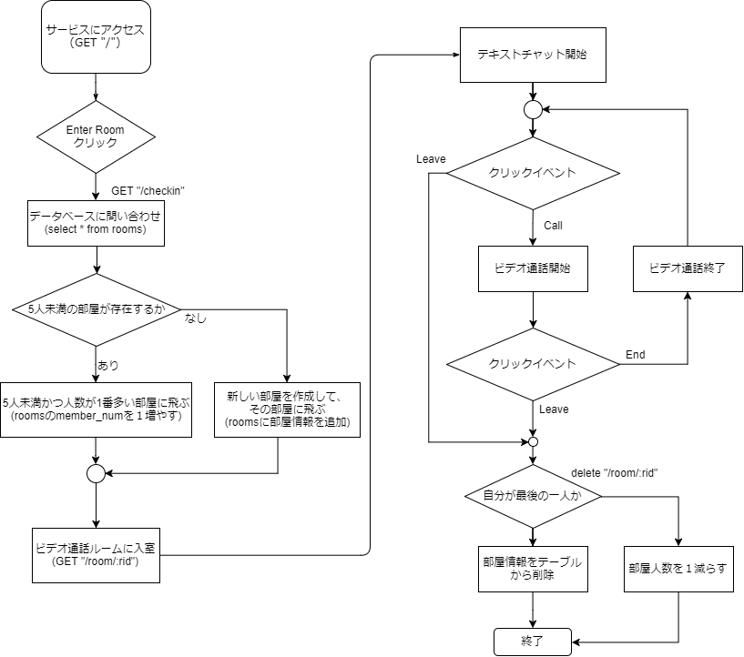

## 開発したアプリケーションの使い方

- サービス名：** STUDYLANCE **
- URL：[https://studylance.herokuapp.com/](https://studylance.herokuapp.com/)
- 使い方：  
トップページにアクセスした後、サイト上部にある「Enter Rooms」ボタンをクリックしていただくと、ビデオ通話ルームにジャンプします。
入室後は、「Call」ボタンでビデオ通話が開始される仕組みとなります。また、他のユーザが入室すると、ページ下部に映像コンテンツが流れます。
さらに、テキストチャットシステムも提供しており、部屋内にいるユーザと簡単なテキストチャットをご利用いただけます。

## アプリケーションの概要説明

- 概要説明：  
STUDYLANCEとは、「Study（勉強）」と「Surveillance（監視）」を組み合わせた造語です。
当サービスでは、入室ボタンをクリックしていただくだけで、簡単に ** クラウド型自習室 ** を利用することができます。
我々が提供する ** クラウド型自習室 ** とは、「互いに見張る」ことをコンセプトにした、WEBカメラとWebRTCを利用した次世代のオンライン学習支援コンテンツです。  
ユーザにできるだけ勉強・作業・仕事・読書に集中していただくために、本サービスは最小限の機能のみを実装し、簡単に利用可能であることを重視しています。
まず、本サービスは既存の通話サービスとは違い、映像のみの配信となっています。無駄話や雑音は勉強の邪魔になると考え、あえて機能を削減しました。
また、ユーザ登録やログインといった操作は、今すぐ勉強したい人にとって煩わしいだろうと考え、ログイン不要の匿名サービスとして提供することにしました。
これによって、いつでも、どこでも簡単に集中できる環境を提供します。

- 対称となるターゲットユーザ  
本サービスのメインターゲットは ** 一人っきりだと勉強出来ない学生 ** です。  
近年、お互い（もしくは複数人で）何か作業をしながらスカイプ（Skype）すること、通称「さぎょイプ」の仲間を募る投稿が掲示板等で多く見受けられます。  
「本当はやりたくないけど、テスト前だから勉強しなくちゃいけない」  
「家で一人で勉強するとサボっちゃう」  
「誰かに見られていると集中力が持続する」  
というような声が中高生を中心に上がっていると私は考えました。  
そこで、家で一人で勉強や作業する人を対象に、映像のみの通話システムを提供することで、自習室のような環境を仮想的に実現します。

## 実装した機能紹介

- 実装した機能  
	各自習室の利用者人数を管理する必要があると考えたため、データベースにテーブル「rooms (部屋ID：rid, 人数：member_num)」を利用しました。各ユーザのアクションと現在の自習室利用状況に応じて部屋の人数を変更したり、部屋の作成及び削除を行っています。
	実装したプログラムのフロー図を以下の図にまとめした。

	

- 技術スペック
	- WebRTC：SkyWay JavaScript SDK
	- サーバーサイド：Node.js（今回が初挑戦）
	- フレームワーク：Express（今回が初挑戦）
	- データベース：PostgresSQL
	- デプロイ環境：Heroku

## 創意工夫した点

- 実装する上でこだわった創意工夫点  
	デザインをよりシンプルにすることでUXの向上を図りました。
- 発生した問題、難しかった箇所
	本システムではユーザが自習室から離脱した際に、データベースを更新する必要があります。Leave(退出)ボタンから離脱した際は、JavaScriptのクリックイベントが発火するため、ajaxでAPIをたたくことができます。
	しかし、ブラウザを閉じるなどの操作によってユーザが離脱した際に、どのようにその離脱イベントを取得するかが分からなかったため、様々なアプローチから解決を試みました。
- どのようにして解決したのか  
	まず、最初に思い付いた解決策は、SkyWayの機能により、部屋内にいる他のユーザがユーザの離脱を検知することができるため(peerLeave)、残っているユーザがDBの更新を行うことを考えた。しかし、複数人数残っている際に、だれが更新を行うのかという判断を自律分散的に行う必要があるため実装が困難でした。  
	いろいろ試行錯誤した結果、JavaScriptにユーザが離脱する際に警告を出す機能があったため、それをトリガーとすることでAPIをたたくことに成功しました。

## その他アピールポイント
現代のWebサービスの特徴は、娯楽を求めたエンターテイメントサービスや利便性を重視したオンラインサービスが中心となって発達していることです。
通話サービスやチャットサービスを例にとっても、「Skype」「Google ハングアウト」「Slack」「LINE」は非常に便利な機能を多く持ち、多くのユーザを獲得することに成功しています。

今回は、それらの既存サービスとの差別化を図るために、あえて<u>「楽しくない、便利じゃないコンテンツ」</u>を提案することに着目してサービス企画を行いました。  
まず、「楽しくない」というテーマに関しては、ユーザに勉強してもらう、作業してもらうことを中心に考えました。
Webコンテンツそのものを楽しんでもらうのではなく、Webサービスを利用しながら別のことに集中してもらう、という点が他のサービスとは異なる点だと思います。  
また、「便利じゃない」というテーマに関しては、機能を最小限に抑えることで、ユーザが実際にサービスを利用するまでの手間が出来るだけ少なくなるように工夫しました。